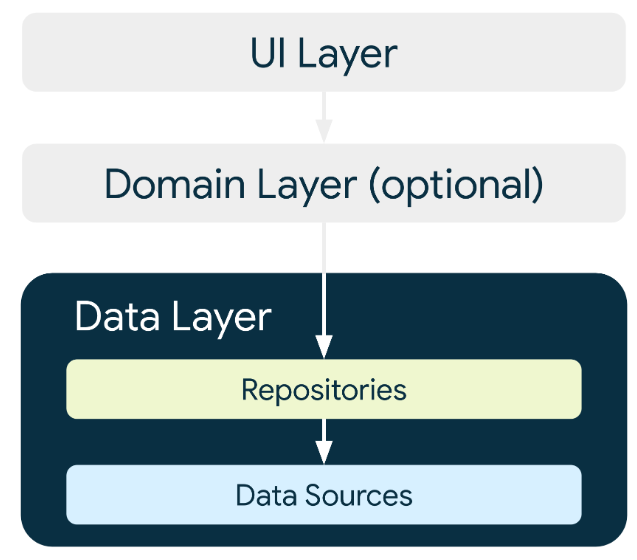
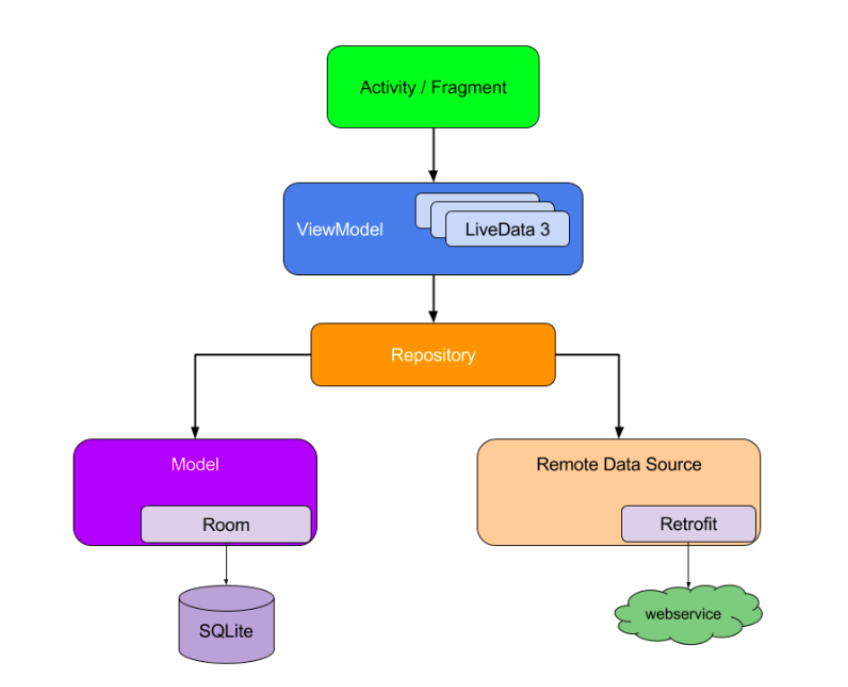

# image_search
내일배움캠프 안드로이드 심화 개인과제 with mvvm 아키텍쳐 연습  

[과제 정리](https://aaapple.tistory.com/99#article-1--%EA%B0%9C%EC%9D%B8-%EA%B3%BC%EC%A0%9C-%EC%A0%95%EB%A6%AC)  
[시연 영상1](https://tv.kakao.com/v/441172788)  
[시연 영상2](https://tv.kakao.com/v/441173583)  

## 1.  과제 개요

**아래 항목의 설명은 위 과제정리 링크에 정리되어있습니다.**  

- 이미지를 검색해서 보관함에 수집하는 안드로이드 앱을 작성해주세요.  
- 이미지 검색 API ( https://developers.kakao.com/docs/latest/ko/daum-search/dev-guide#search-image ) 의 thumbnail_url 필드  
- 동영상 검색 API (https://developers.kakao.com/docs/latest/ko/daum-search/dev-guide#search-video ) 의 thumbnail 필드  
- 두 검색 결과를 datetime 필드를 이용해 정렬하여 출력합니다. (최신부터 나타나도록)  

- 첫 번째 fragment : 검색 결과  
    -  검색어를 입력할 수 있습니다.  
    - 검색된 이미지 리스트가 나타납니다. 각 아이템에는 이미지와 함께 날짜와 시간을 표시합니다.  
    - 스크롤을 통해 다음 페이지를 불러옵니다.  
    - 리스트에서 특정 이미지를 선택하여 '내 보관함'으로 저장할 수 있습니다.  
    - 이미 보관된 이미지는 특별한 표시를 보여줍니다. (좋아요/별표/하트 등)  
    - 보관된 이미지를 다시 선택하여 보관함에서 제거 가능합니다.  

- 두 번째 fragment: 내 보관함  
    - 검색 결과에서 보관했던 이미지들이 보관한 순서대로 보입니다.  
    - 보관한 이미지 리스트는 앱 재시작 후 다시 보여야 합니다. (SharedPreferences 사용 권장)  

  

++ 공식 문서에 있는 repository pattern도 함께 연습        

장점    
 - 데이터가 있는 여러 저장소(Local Data Source, Remote Data Source)를 추상화하여 중앙 집중 처리 방식을 구현할 수 있음    
 - ViewModel은 repository가 local에서 데이터를 받아오는 지, remote에서 데이터를 받아오는 지 출처를 모르게 됨    
 - 결국 제공해주는 데이터를 이용만 하면 되므로, ViewModel은 비즈니스 로직에만 집중 할 수 있음      

